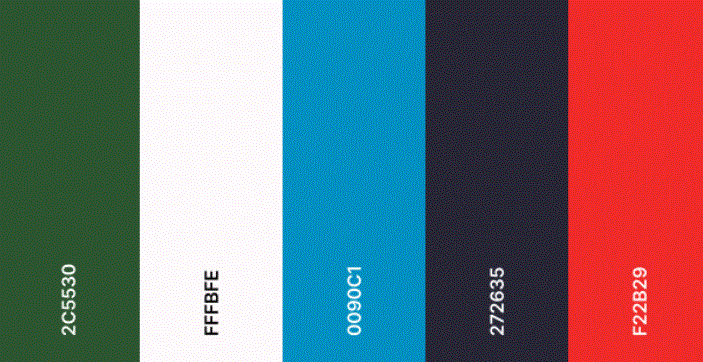

# Oh, Canada! #
For my second milestone project I have came up with an idea to create a fun and informative quiz about Canada. Canada is quite often overshadowed by it's neighbor to the south so I wanted to create a quiz that hightlights what an amazing country Canada is. 

### Site owner's goals ###
To create a fun and engaging quiz using html, css and vanilla javascript that will allow a player to answer a series of questions and get their score at the end. 
To do this I plan to implement the following features:
- An input field for the player
- A score tracking system
- A series of questions and possible answers
- Upon submitting an answer the player will be told if they answerwed correctly or incorrectly and given a factual information about the correct answer
- A submission form where they can submit their own facts about Canada 

### External user goals ###
To be able to play a quiz that will test their knowledge on Canada and to be able to know how well they did and hopefully learn some new facts about Canada

##UX##

### Strategy ### 

### Scope ###

### Structure ###

This will be a simple website where the user will be presented with some general information on the quiz and the abilty to input their name and then press the 'Start quiz' button that will lead them through a series of questions testing their general knowlege of Canada and informing them of facts about each correct answer.

The site will be easy to navigate and intuitive to all the user to have a pleasant experience. 

### Skeleton ###

Wireframes
-  [Mobile](docs/readme.images/mobile-wireframe.GIF)
-  [Web Home](docs/readme_images/web_wireframe%20_home.GIF)
-  [Web Home](docs/readme_images/web_wireframe_question.GIF)
-  [Web Home](docs/readme_images/web_wireframe_answer.GIF)

The wireframes were created as a base for this project to help me get a concrete visual of what I wanted and needed to build for this project. It will be a reference point thoughout and it will help me visualize what I need to create in my html, css and js documents 

### Surface ###

I have chosen colors that are found all across the Canadian landscape and will resonate with anyone who has seen photos of Canada. 

I have chosen Open Sans and Libre Bakersville fonts as similar fonts are used for the offical Canada wordmarks so I feel they will resonate with the site user. 

## Features ##

## Credits ##
I have used the following tutorials as inspiration to create this quiz [SitePoint](https://www.sitepoint.com/simple-javascript-quiz/) and Youtube, most notably [CodingNepal](https://www.youtube.com/watch?v=WUBhpSRS_fk&t=5s) and [BrianDesign](https://www.youtube.com/watch?v=f4fB9Xg2JEY)